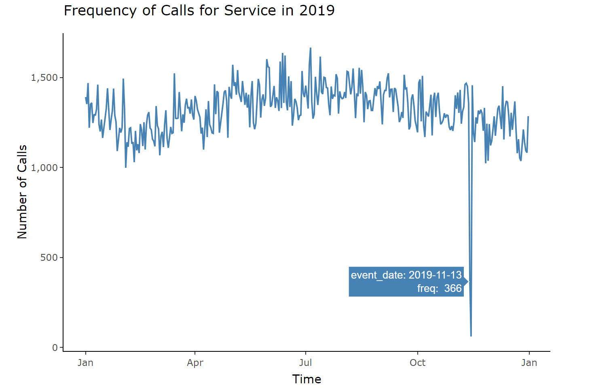
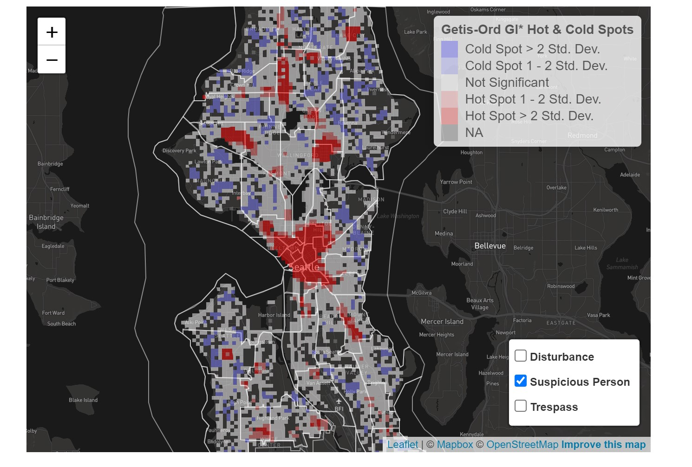
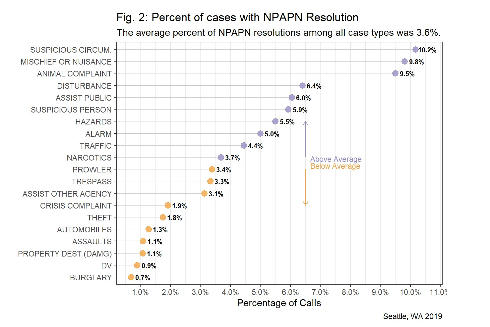

Below are examples of thorough explanatory data analysis that presented as a series of web reports for a professor at Stanford University. The work showcases my ability to use R Markdown, Plotly, and Leaflet for interactive graphs, tables, and maps. 

**View Github Repo:** <a href="https://github.com/francine-stephens/seattle911" style="margin-left: 1em"> <button class="btn btn-outline-dark"> <i class="fab fa-github fa-lg"></i> Code</button> </a>


## Seattle 911 Calls EDA

```{r, echo=FALSE, fig.cap= "Interactive Time Series Graph from Exploratory Analysis"}


```

**View Full Website:** <a href="https://francine-stephens.github.io/francinestephens.github.io/cad19_eda.html#" style="margin-left: 1em"> <button class="btn btn-outline-dark"> <i class="fa-solid fa-file-image"></i> Web-Report</button> </a> 

---

## Seattle 911 Calls for Disturbance, Suspicious Persons, and Trespass Complaints

```{r, echo=FALSE, fig.cap= "Interactive Hot Spot Map of Suspicious Person Calls"}


```

**View Full Website:** <a href="https://francine-stephens.github.io/francinestephens.github.io/deep_dive_disturbance_suspicious_person_trespass.html#" style="margin-left: 1em"> <button class="btn btn-outline-dark"> <i class="fa-solid fa-file-image"></i> Web-Report</button> </a> 

---


## Seattle 911 Calls: No Police Action Taken (NPAPN)

```{r, echo=FALSE, fig.cap= "Dot Plot of Case Types Resolved with No Police Action Taken"}


```

**View Full Website:** <a href="https://francine-stephens.github.io/francinestephens.github.io/deep_dive_no_police_action_possible_necessary.html#" style="margin-left: 1em"> <button class="btn btn-outline-dark"> <i class="fa-solid fa-file-image"></i> Web-Report</button> </a> 

