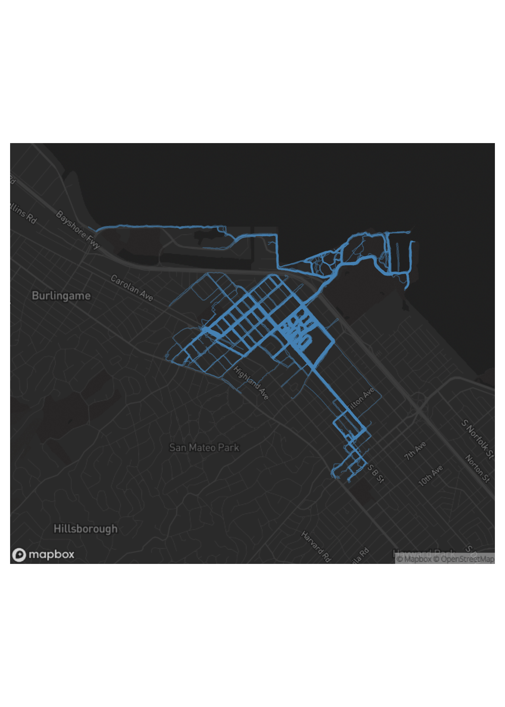
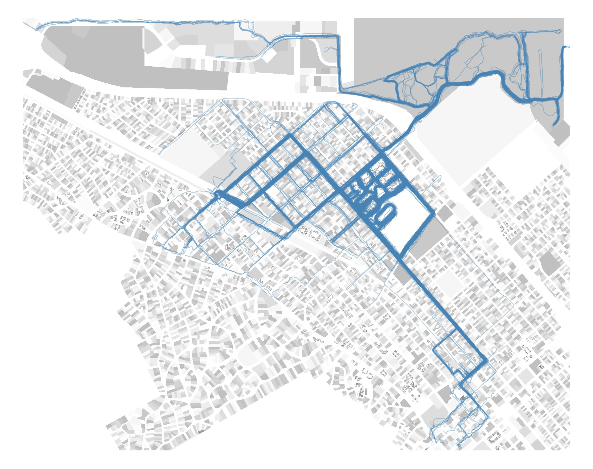
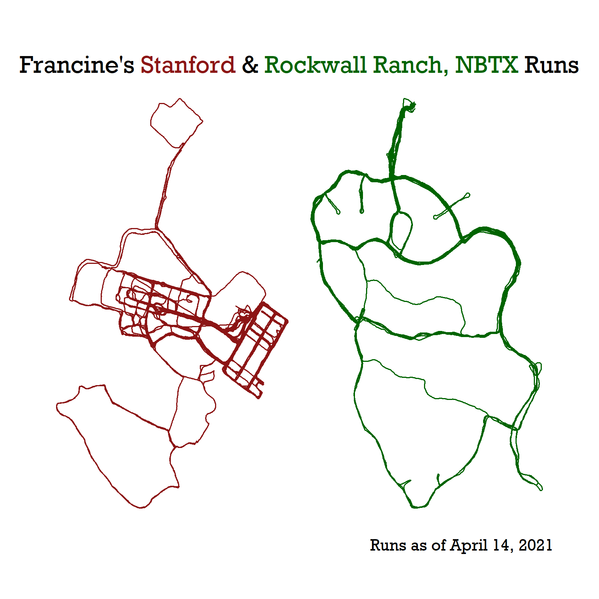
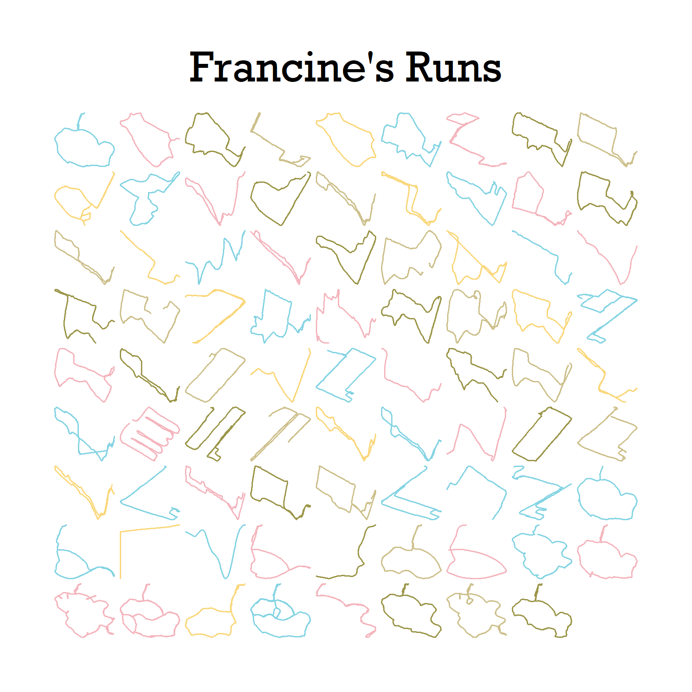
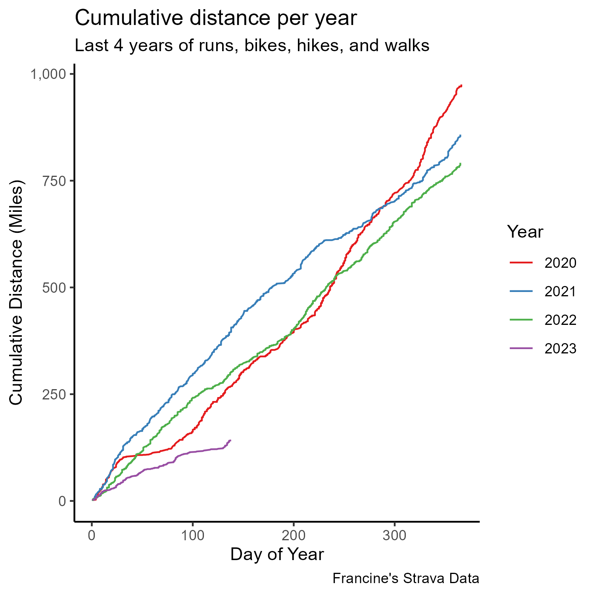
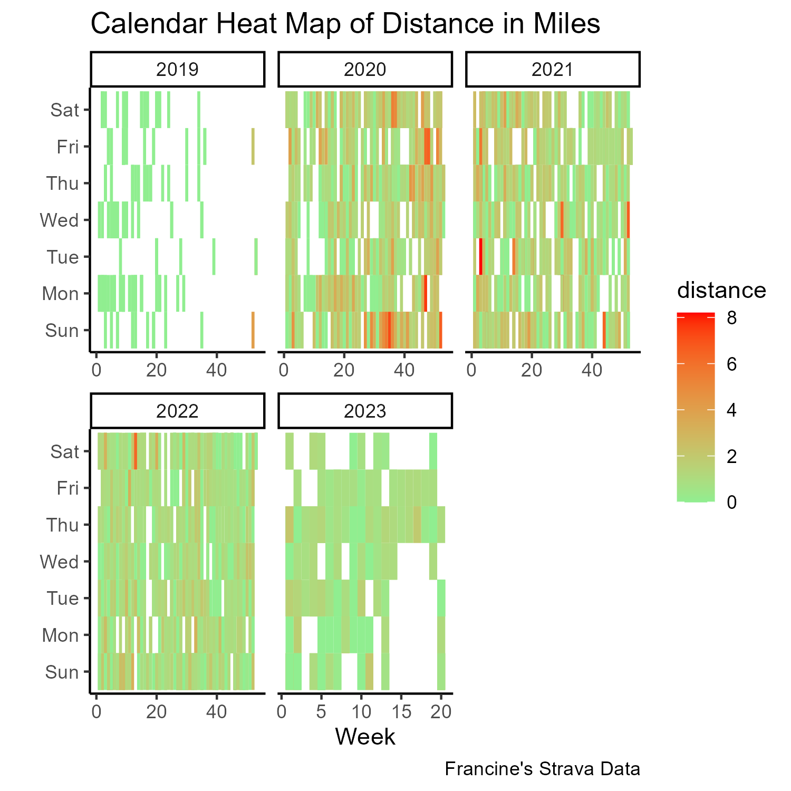
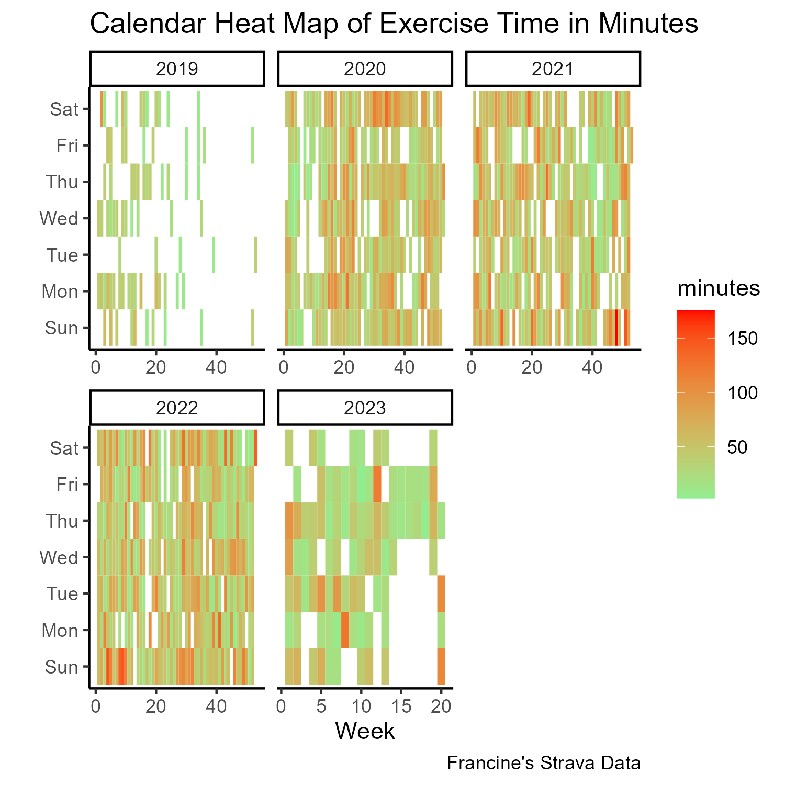

When I have some downtime, I extract my Strava activities from the Strava API to practice minimalist visualizations and view trends in my exercise activities. I stock-pile the visuals here to have a single place where I can refer to what visuals I have previously made, so that I can formulate what  to practice on in the future. 

## Runs

### Identifying my running neighborhood

I filtered down to the top 20% of routes I traversed in the last two years, which is how long I have lived in San Mateo. The code reveals the substantial amount of data wrangling that went into transforming a non-spatial dataframe with Google Polylines into spatial routes (lines).

The maps show that my running neighborhood skirts along the boundaries of San Mateo and Burlingame. This is why I call my neighborhood "Bur Mateo." 

```{r, eval=FALSE}
# Wrangle activites to routes
decoded_polyline <- googlePolylines::decode(
  activities_summary_polyline$map.summary_polyline)

unlist_polyline <- map_df(decoded_polyline, ~as.data.frame(.x), .id="id")

full_polyline_df <- unlist_polyline %>% 
  left_join(., activities_summary_polyline_id, by = c("id" = "id_p"))
points_to_line <- function(data, long, lat, id_field = NULL, sort_field = NULL) {
  
  # Convert to SpatialPointsDataFrame
  coordinates(data) <- c(long, lat)
  
  # If there is a sort field...
  if (!is.null(sort_field)) {
    if (!is.null(id_field)) {
      data <- data[order(data[[id_field]], data[[sort_field]]), ]
    } else {
      data <- data[order(data[[sort_field]]), ]
    }
  }
  
  # If there is only one path...
  if (is.null(id_field)) {
    
    lines <- SpatialLines(list(Lines(list(Line(data)), "id")))
    
    return(lines)
    
    # Now, if we have multiple lines...
  } else if (!is.null(id_field)) {  
    
    # Split into a list by ID field
    paths <- sp::split(data, data[[id_field]])
    
    sp_lines <- SpatialLines(list(Lines(list(Line(paths[[1]])), "line1")))
    
    # I like for loops, what can I say...
    for (p in 2:length(paths)) {
      id <- paste0("line", as.character(p))
      l <- SpatialLines(list(Lines(list(Line(paths[[p]])), id)))
      sp_lines <- spRbind(sp_lines, l)
    }
    
    return(sp_lines)
  }
}

burmateo <- full_polyline_df %>%
  filter(lon >=-122.37 & lon <= -122.0) %>%
  filter(lat >= 37.55 & lat <= 37.65)

v_lines <- points_to_line(data = burmateo,                            , 
                          long = "lon", 
                          lat = "lat", 
                          id_field = "id")

v_lines_sf <- as(v_lines, 
                 "sf") 
st_crs(v_lines_sf) <- 4326
dark_basemap <- cc_location(loc = raster::extent(v_lines_sf), 
  #zoom = 12,
  get_tiles = "https://api.mapbox.com/styles/v1/mapbox/dark-v10/tiles/{zoom}/{x}/{y}",
  access_token = token) 

lines_bbox <- st_as_sfc(st_bbox(v_lines_sf))

# Draw Map
tm_static_nhood <- 
  tm_static_mapbox(location = v_lines_sf %>% 
                     st_transform(7131), 
    style_url = "mapbox://styles/francinestephens/cli17a3cl00v501pohaykfiqe",
    username = user) +
  tm_shape(v_lines_sf  %>% 
             st_transform(7131)) + 
  tm_lines(alpha = 0.4, 
           col = "steelblue") + 
  tm_layout(frame = FALSE)
```

```{r, echo=FALSE, fig.cap="Local Running Routes on a basemap", out.height="50%"}

```

I wanted to plot the runs against parcel data, which are one of my favorite spatial data types to work with to create a minimalist-look. To capture the subset of parcels in my running neighborhood, I created a bounding to clip the county's parcels down to just the window that features my neighborhood. 

```{r, eval=FALSE}
# PARCELS 
st_crs(parcels)
parcels_reduced <- parcels %>% 
  st_transform(., crs = 4326) %>%
  filter(city == "SAN MATEO"  | city == "BURLINGAME") %>% 
  st_intersection(., lines_bbox)

parcel_version <- 
  tm_shape(smc) + 
  tm_fill(col = "white") + 
  tm_shape(parcels_reduced) + 
  tm_fill("MAP_COLORS", palette="Greys", alpha = .25) + 
  tm_shape(v_lines_sf) + 
  tm_lines(alpha = 0.4, 
           col = "steelblue") + 
  tm_layout(frame = FALSE, bg.color = "white"
            )
```

```{r, echo=FALSE, fig.cap="Minimalist view of runs plotted against parcels"}

```

### Pandemic runs


The images below are limited to my runs at Stanford and in the Texas Hill Country, which were the two locations that I split time in during this period.

```{r, eval=FALSE}
# SET COLORS AND THEMES
stanford_cardinal <- "#8C1515"
dark_green <- "#006400"

colors_runs <- scale_color_manual(values = c(stanford_cardinal,
                                             dark_green)
) 

theme_by_location <- theme_void(base_family = "Rockwell",
                                base_size = 13) +
  theme(panel.spacing = unit(0, "lines"),
        strip.background = element_blank(),
        strip.text = element_blank(),
        plot.margin = unit(rep(1, 4), "cm"),
        legend.position = "none",
        plot.title = element_markdown(hjust = 0.5, vjust = 3)
  )

runs_by_location <- ggplot(all_runs) +
  geom_path(aes(lng, lat, group = id, color = location), size = 0.35, lineend = "round") +
  facet_wrap(~location, scales = 'free') +
  labs(title = "Francine's 
       <span style='color:#8C1515'>Stanford</span> & <span style='color:#006400'>Rockwall Ranch, NBTX</span> Runs",
       caption = "Runs as of April 14, 2021") +
  theme_by_location +
  colors_runs

```

```{r, echo=FALSE}


```

```{r, eval=FALSE}
theme_runs <- theme_void(base_family = "Rockwell",
                         base_size = 20) +
  theme(panel.spacing = unit(0, "lines"),
        strip.background = element_blank(),
        strip.text = element_blank(),
        plot.margin = unit(rep(1, 4), "cm"),
        legend.position = "none",
        plot.title = element_text(hjust = 0.5, vjust = 3)
  )

runs_moonrise <-  ggplot(all_runs) +
  geom_path(aes(lng, lat, group = id, color = group_col), size = 0.35, lineend = "round") +
  facet_wrap(~id, scales = 'free') + 
  labs(title = "Francine's Runs") + 
  theme_runs + 
  scale_color_manual(values=wes_palette(n=5, name="Moonrise3"))
```

```{r, echo = FALSE}


```

## All Activities

The following graphs that document the distance and minutes exercised over the last four years show how much working on my dissertation has reduced my ability to run/bike/hike/walk as far or as frequently as before I got into the weeds of the dissertation. Hopefully, the 2023 trends will start to increase at a high clip and become closer to the exercise levels of early 2022 and 2021.

### Distance

```{r, eval=FALSE}
activities_data_c <- activities_data %>%
  mutate(start_date = as_date(start_date),
         year = year(start_date),
         day_of_year = yday(start_date),
         month = month(start_date),
         day = wday(start_date, label = TRUE),
         week = week(start_date))

activities_data_c %>%
  group_by(year) %>%
  arrange(start_date) %>%
  mutate(cumulative_distance = cumsum(distance)) %>%
  ungroup() %>% 
  filter(year > 2019) %>%
  ggplot(aes(x = day_of_year, y = cumulative_distance, color = factor(year))) +
  geom_line() +
  scale_y_continuous(labels = scales::comma) + 
  scale_color_brewer(palette = "Set1") +
  labs(title = "Cumulative distance per year",
       subtitle = "Last 4 years of runs, bikes, hikes, and walks",
       x = "Day of Year",
       y = "Cumulative Distance (Miles)",
       color = "Year",
       caption = "Francine's Strava Data") + 
  theme_classic()
```

```{r, echo=FALSE}

```

```{r, eval = FALSE}
# CALENDAR HEAT MAP OF DISTANCE COVERED EACH DAY
ggplot(activities_data_c %>% 
         filter(year > 2018), aes(x = week, y = factor(day))) +
  geom_tile(aes(fill = distance)) +
  scale_fill_continuous(low = "lightgreen",
                        high = "red") +
  facet_wrap(~ year,
             scales = "free_x") +
  labs(x = "Week",
       y = "",
       title = "Calendar Heat Map of Distance in Miles",
       caption = "Francine's Strava Data") + 
  theme_classic()
```

```{r, echo=FALSE}


```

### Time

```{r, eval=FALSE}
ggplot(activities_data_c %>% 
         filter(year > 2018) %>% 
         group_by(year, week, day) %>% 
         summarize(time = sum(elapsed_time, na.rm = TRUE)) %>% 
         ungroup() %>% 
         mutate(minutes = time/60), 
       aes(x = week, y = factor(day))) +
  geom_tile(aes(fill = minutes)) +
  scale_fill_continuous(low = "lightgreen",
                        high = "red") +
  facet_wrap(~ year,
             scales = "free_x") +
  labs(x = "Week",
       y = "",
       title = "Calendar Heat Map of Exercise Time in Minutes",
       caption = "Francine's Strava Data") + 
  theme_classic()

```

```{r, echo=FALSE}

```

