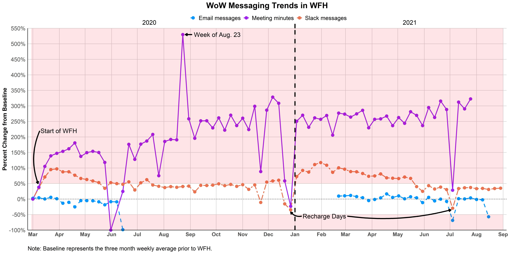

# Communication during Work-From-Home

* I extracted Intuit's messaging data from Outlook email, Zoom web calls, and Slack messages and aggregated the records to the enterprise level per week to show trends in messaging overload. 
  * The visual is a replica of a graphic I created during my tenure at Intuit; data have been altered from real data to replicate the graph without revealing Intuit's data.
* I used R for the data extraction, cleaning, and visualization. 
* The visual showcases my design aesthetic - functional and minimalist.

```{r, echo=FALSE, out.height="150%", fig.cap= "Messaging Trends in the Pandemic Work-From-Home Era. Note: Outlook email data was missing for last half of 2020 and first two months of 2021 due to database system transition."}


```

**Insights**

* Zoom meeting minutes were generally at or above 200% baseline meeting minutes from August 2020 onward, suggesting that adoption of Zoom for meetings, check-ins, and social gatherings. 
* Slack and email communication are far more stable than Zoom minutes during busier quarters (e.g., tax season). 
* Recharge days achieve the desired effect of encouraging employees to take a break from the day-to-day activities in their work. 


**Visualization Code:** <a href="create_graph.R" style="margin-left: 1em"> <button class="btn btn-outline-dark"> <i class="fa-solid fa-code"></i> Code</button> </a>

*Note:* data extraction code was excuted in a different script. 
