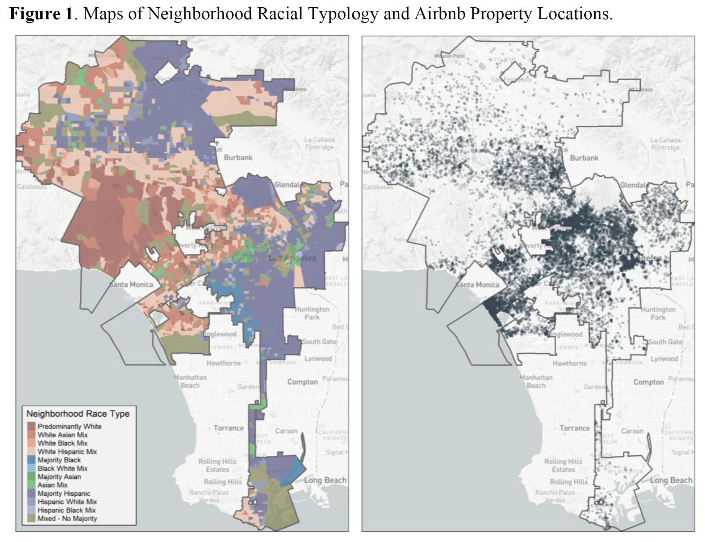
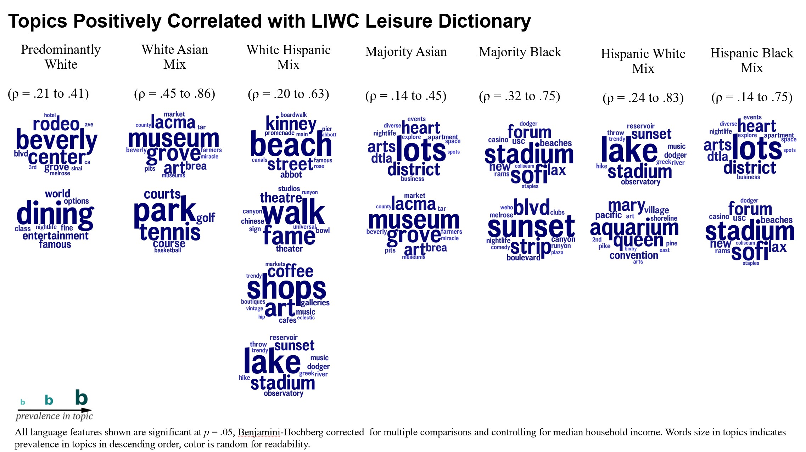
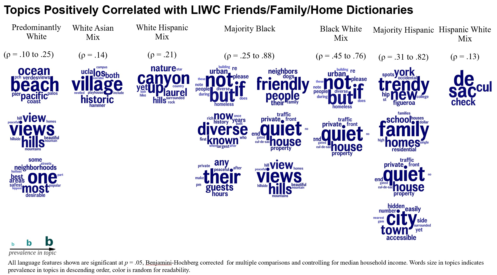

**Abstract:** This study investigates how place-based entrepreneurs market their neighborhoods to prospective visitors in the face of deeply entrenched stereotypes about neighborhoods of color and the urban core. I leverage place-based geospatial sentiment data from 19,967 Airbnb listings located in Los Angeles, California located in 2,156 census block groups of which 1,316 (61%) were not majority white and apply NLP topic modeling. Hosts’ descriptions of predominantly white neighborhoods focus on the physical and landscape aesthetics of the neighborhood, whereas minority-majority neighborhoods include more details about residents as well as the safety of the community. Language that deflects negative stereotypes about minority neighborhoods is most explicit in descriptions of urban core neighborhoods where Black residents are the majority or plurality. Overall, the findings suggest that the neighborhood marketing strategies in Airbnb’s online platform transmit existing urban inequalities to prospective tourists by implicitly or explicitly engaging with stereotypes about race and urban life.

<p> 
<a href="https://drive.google.com/file/d/1nGGi_5eVwQMNFPY1NU2hNm4zRFn2vM9B/view?usp=drive_link" style="margin-left: 3em"> <button class="btn btn-outline-dark"> <i class="fas fa-file-pdf fa-lg"></i> Paper</button> </a> 
<a href="https://docs.google.com/presentation/d/1pxY3osLW_mKuo-1qQmbmOXy75DOP85LNoI-4FC4rt0I/edit?usp=sharing" style="margin-left: 1em"> <button class="btn btn-outline-dark"> <i class="fa-solid fa-file-powerpoint fa-lg"></i> Slides</button> </a>
<a href="https://docs.google.com/presentation/d/1O3EardB3ERWmM7m9A6I6izQPR7cnVexIMm3wNZR4R_Q/edit?usp=sharing" style="margin-left: 1em"> <button class="btn btn-outline-dark"> <i class="fa-solid fa-file-powerpoint fa-lg"></i> Lightning Talk Slides</button> </a>
</p>

# Selected Visualizations
```{r, echo=FALSE}


```

**Study Area & Sample.** Among the 2,156 neighborhoods, the most common racial types were Majority Hispanic (35%) and White-Hispanic Mixed (20%). The average median household income of neighborhoods was $94,367 (SD = 46,394). Neighborhoods where white residents were the most common group accounted for 39% of the sample, and they tended to be more affluent (average median household income = $110,064 vs. $72,518 for all other neighborhood types).

```{r, echo=FALSE, fig.cap= "Figure 3"}


```

**Leisure Activities and Amenities.** The language used to describe leisure activities and amenities differed across racial neighborhood types (see Figure 3). As a group, the whitest neighborhood types had the greatest number of significant topics in this leisure activity/amenities LIWC dictionary category compared to all other race types. The leisure-related topics that surfaced in predominantly white neighborhood descriptions –upscale dining and shopping experiences (fine dining, Grove, Rodeo Drive) – can be construed as classed-amenities, which distinguishes the topics from the majority white mixed neighborhood types, which brought up shops and retail establishments (shops, art, cafes, boutiques) that did not signal class as clearly. Majority white Asian mixed and majority white Hispanic mixed types showed significant correlations with outdoor and physical activities (park-going, golfing, tennis, beach-going) and cultural institutions and arts activities (theaters, art museum, galleries). Albeit white residents are not the majority in Hispanic white mixed neighborhood, this type also contains topics associated with outdoor activities (Echo Lake Park, hiking, aquarium, shoreline) this suggests that as the share of white residents increases, neighborhood descriptions are more likely to surface outdoor activities or points of interest.

On the other hand, Majority Asian, Hispanic Black mixed, and Black white Mixed neighborhoods commonly referenced the many amenities of the downtown district (nightlife, events, arts, businesses) for guests to explore. Majority Black neighborhoods focused on proximity to major entertainment points of interest including professional sporting and gambling venues (stadium, casino, coliseum). Across the neighborhood types where minorities were the majority, the leisure amenities are part of the built environment associated with urban life.

```{r, echo=FALSE, fig.cap="Figure 4"}


```

**Family, Friends, and Homes.** Topics that were correlated with LIWC’s family, friends, and home dictionaries also demonstrated racialized patterns (see Figure 4). Nature and images associated with lower levels of urbanicity appear in the topics positively associated with the LIWC Friends/Family/Home dictionaries for the whitest neighborhood types and the most Hispanic neighborhoods. Predominantly white neighborhoods described the aesthetics of the neighborhood having beautiful views of nature (views of mountains, hills, tree-lined streets, ocean) and white Hispanic mixed neighborhoods emphasized their neighborhoods’ location in hills (up, high, canyon). Descriptions of white Asian mixed neighborhoods focused on the physical layout of the neighborhood in the style of an urban village (village, nestled, campus, historic). By emphasizing characteristics of the neighborhood and apartments layout that signal medium-density housing and mixed-use zoning the hosts paint a picture of a less urbanized neighborhood. Similarly, in neighborhoods where Hispanics are the majority or plurality the descriptions contain language that signals more suburbanized style of housing by referencing zoning and home values (single-family, million dollar), quiet homes and streets (private, gated, cul-de-sacs, no traffic, hidden gem), and trendy college-town retail (hip, spots). The similarity across white Asian mixed, majority Hispanic, and Hispanic white mixed neighborhoods are the prevalence of descriptors that diverge from prototypical images of urbanicity. However, the sharpest divergence from high urbanicity appeared in the descriptors in predominantly white neighborhoods, which leaned into natural scenery present in exurban environments.

In contrast to the majority White neighborhoods, the descriptions of majority Hispanic, Majority Black, and Black-White mixed neighborhoods attended to the demographic characteristics of the people in the neighborhood and physical assurances of safety offered by the housing and built environment. Majority Black and majority Hispanic neighborhood descriptions had the greatest number of topics correlated with this dictionary and the strongest magnitudes of correlations. One common descriptor across majority Black, majority Hispanic, and Black white mix neighborhoods is the image of quiet homes/streets. Noise-level also comes up for majority Black neighborhoods in the form of language that provides rules for guests about curfews and policies (pm, guests, after hours) to maintain the peacefulness and quiet of the neighborhood. In Hispanic neighborhoods, the emphasis was on a family-friendly environment (family-oriented, schools, residential), whereas descriptors of majority Black neighborhoods emphasized diversity (culture, ethnicity, histories) and friendliness (dogs, neighborly, pleasant) of the residents. Safety was discussed across both Majority Black and Hispanic neighborhoods, but largely in the context of the physical design of the homes (cul-de-sacs, no traffic, private property, gated, peaceful, quiet hours, peacefulness, security). Although safety appeared in the descriptions of predominantly white neighborhoods, it came up in general terms with superlative language that described the neighborhood’s desirability (safest, most desirable, best areas) but did not feature significant discussion of physical infrastructures or means of offering greater safety. Lastly, “urban” was a common descriptor across Majority Black and Black-White Mixed neighborhoods. However, it is unique from the other topics because it contains negating language in relation to the homeless population (urban, diverse, but, note, homeless, people). Below are two listings that demonstrate how hosts frame their neighborhood as desirable despite the presence of a homeless population:


> “The area is ridiculously hip. Feel free to search "Arts District Los Angeles" and "Little Tokyo" to read up on the hood. Keep in mind that most parts of Los Angeles these days has (sic) a homeless problem. Downtown Los Angeles and its surrounding areas are not exempt. Luckily for us, we have a well lit building and a great security system.”

> “LA Times just called us (Jefferson Park) the hottest up and coming neighborhood [sic]...however, We've lived here before it was "up and coming" and still loved it! If you need a Whole Foods, BMWs, and fancy lawns, you might want to stay in Beverly Hills. If you like dollar ice cream trucks, street tamale vendors and neighbors who look out for each other - we'd love to have you! Like most expensive cities, we have homeless people, some blight, and you're likely to hear several languages on my block (I'm Filipino-American and people on my block are of every persuasion). Most who come with open minds find it to be a friendly, diverse, working and middle-class community.”


Altogether, the topics that were most strongly associated with humanizing details provide portraits of the social, natural, and built environments of the neighborhoods and how they relate to neighborhood racial composition. Whereas the leisure-related topics identified neighborhood-level racial differences in the points of interest and activity spaces that are marketed in listings.

