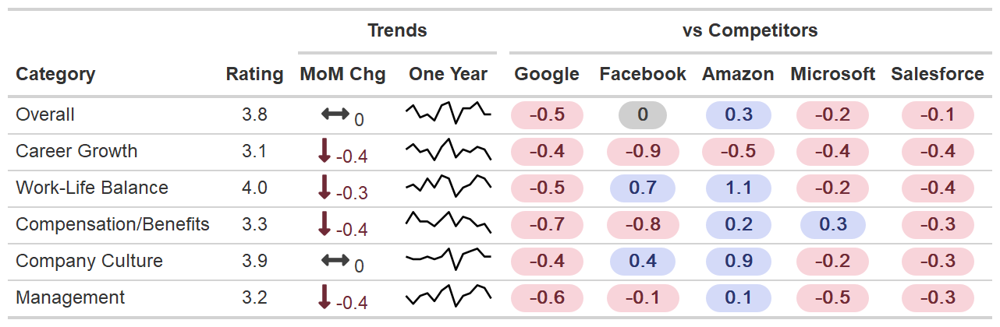
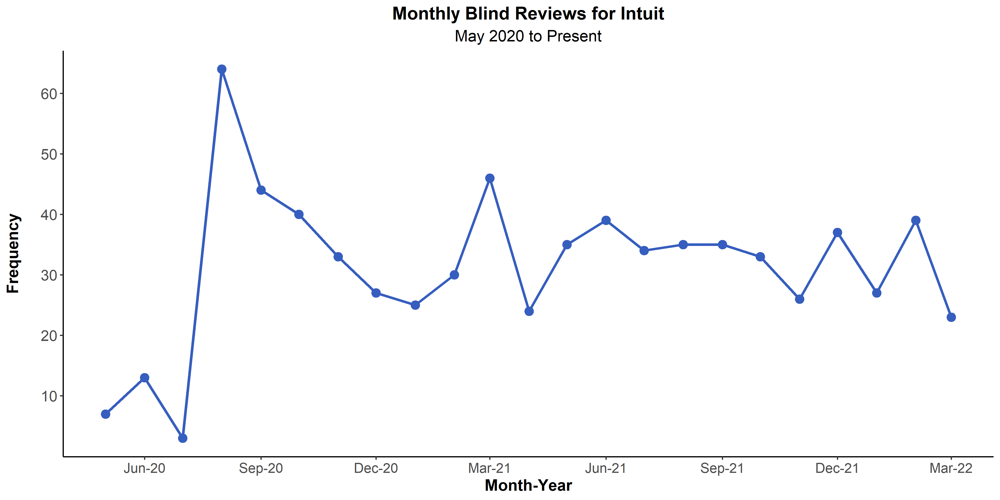

When I interned at Intuit, my manager expressed interest in having a channel that included some competitive intelligence so that we could compare the employee experience at Intuit to the experience at competitors. She was interested in the reviews employees leave anonymously on [Blind](https://www.teamblind.com/){target="_blank"}. 

Based on her vision, I crafted the code to scrape ratings on Intuit's Blind page and the pages of five other competitors: Microsoft, Salesforce, Google, Facebook/Meta, and Amazon and analyze the reviews on a monthly basis. The images and slide deck below show the final outputs of the end-to-end process that I devised. 

```{r, echo=FALSE, fig.cap= "Ratings Overview"}


```


```{r, echo=FALSE, fig.cap= "Monthly Review Frequency"}


```

#View the components of the end-to-end Blind Reviews Workflow:

<p>
- **The Deliverable:** I mocked up the slides included on the Blind monthly analysis that we would present to the managers of the analytics and research team. <a href="https://docs.google.com/presentation/d/11vu7u_p9DwfU4wJlozWZ5LLzi8tjJLTNF8ulOwUAufg/edit?usp=sharing" style="margin-left: 1em"> <button class="btn btn-outline-dark"> <i class="fa-solid fa-file-powerpoint fa-lg"></i> Slides</button> </a>
- **Scraping Functions:** These functions are imported into the execution script and can be seen below. <a href="https://github.com/francine-stephens/blind_reviews/blob/main/scrape_blind_reviews_scalar_ratings.R" style="margin-left: 1em"> <button class="btn btn-outline-dark"> <i class="fa-solid fa-code"></i> Code</button> </a> 
- **Executable Scraping Script:** <a href="execute_blind_webscraper.html" style="margin-left: 1em"> <button class="btn btn-outline-dark"> <i class="fa-solid fa-code"></i> Code</button> </a> 
- **Analysis Script:** <a href="analyze_blind_reviews.html" style="margin-left: 1em"> <button class="btn btn-outline-dark"> <i class="fa-solid fa-code"></i> Code</button> </a> 
- **All Code:** <a href="https://github.com/francine-stephens/blind_reviews/tree/main" style="margin-left: 1em"> <button class="btn btn-outline-dark"> <i class="fab fa-github fa-lg"></i> GitHub Repo</button> </a>
</p>


# Scraping & Cleaning Functions


```{r source scraping functions, include=FALSE, eval=FALSE}
source("scrape_blind_reviews_scalar_ratings.R", local = knitr::knit_global())
```

```{r function code, file='scrape_blind_reviews_scalar_ratings.R', eval=FALSE}
```

