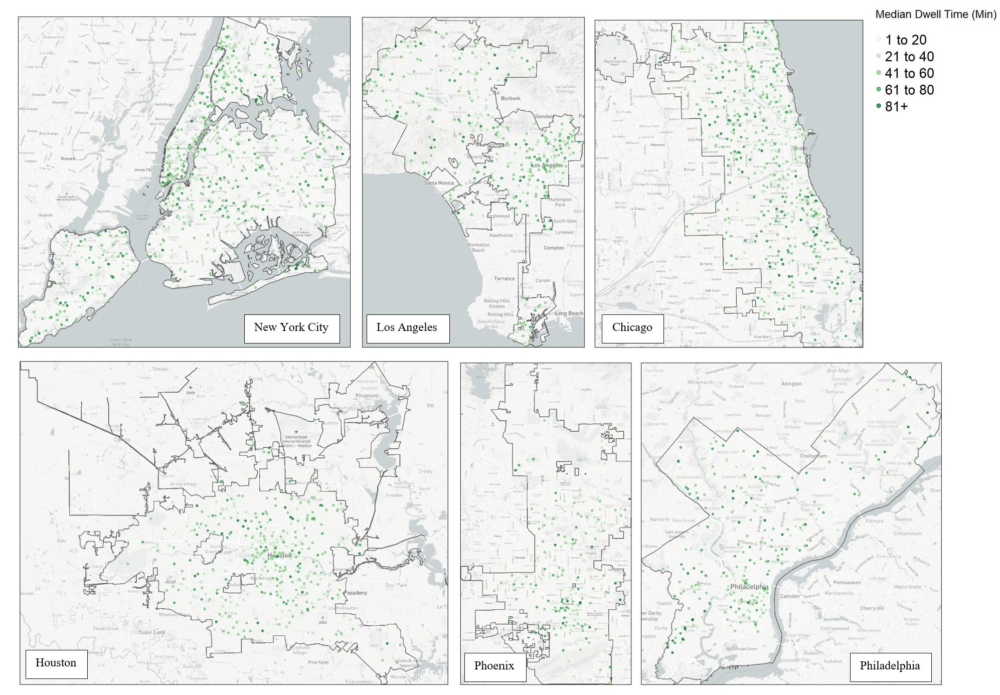
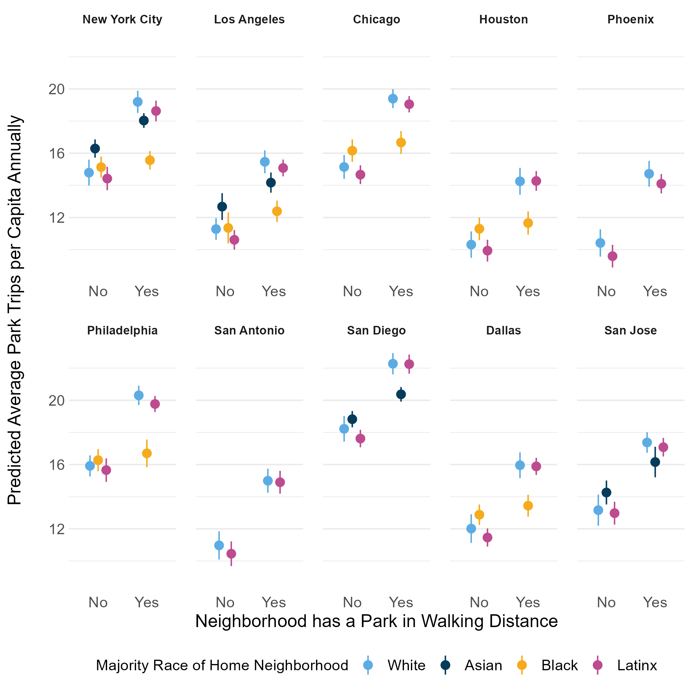
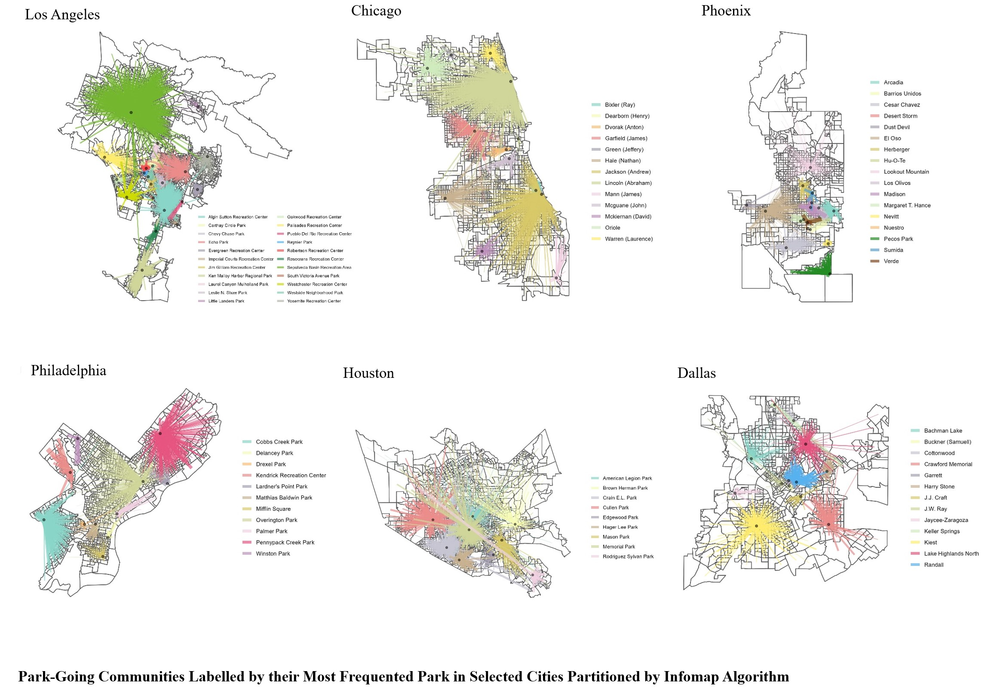

<!-- Google tag (gtag.js) -->
<script async src="https://www.googletagmanager.com/gtag/js?id=G-Z5FMF0LVZS"></script>
<script>
  window.dataLayer = window.dataLayer || [];
  function gtag(){dataLayer.push(arguments);}
  gtag('js', new Date());

  gtag('config', 'G-Z5FMF0LVZS');
</script>


**Note:** This page is still under-development (likely through July) as a I continue to edit my dissertation chapters and figure out the best way to present these very long chapters.


## Paper 1: The Socio-Spatial Magnetism of Parks Located in Racially Diverse Neighborhoods

**Abstract:** Urban theorist Jane Jacobs’ concept and theory of urban vitality has served as a guide for creating more attractive park spaces in many cities around the world. Jacobs’ proposition that park spaces located in socially diverse neighborhood contexts are most attractive to urban residents overlooks the role racial prejudices have played in shaping ideologies of park design and provisioning neighborhoods with different qualities of parks based on race. Motivated by the historical evidence of environmental racism in the cultural politics of park provision, this study revisits the principle of social diversity in Jacobs’ theory of urban vitality by focusing on the relationship between a park’s neighborhood racial context and its ability to attract visitors. I leverage SafeGraph point-of-interest data on park visitors, the distances visitors traveled to parks, and visitors’ median dwell time in 3,002 parks in America’s ten most populous cities in 2019 to test the association between a park’s attractiveness and neighborhood racial diversity. Results from spatial regression models with city fixed effects confirm Jacobs’ theory. Parks located in the most racially diverse neighborhoods average higher rates of monthly visitors and visitors that travel further distances to visit the park. Despite the considerable volume and geographic extent of visitors that parks in racially diverse neighborhoods attract, they have lower dwell times compared to parks in more racially homogeneous neighborhoods. The findings have implications for sustainable planning and the use of racial context as site-situation criteria for new park development.

<p> 
<a href="https://drive.google.com/file/d/1BWfAF3qWs0Ehk4qnWCpvTis6sALTk8Vz/view?usp=sharing" style="margin-left: 3em"> <button class="btn btn-outline-dark"> <i class="fas fa-file-pdf fa-lg"></i> Paper 1</button> </a> 
</p>

```{r, echo=FALSE, fig.cap= "Choropleth of Median Dwell Time by City"}


```

## Paper 2: Neighborhood-Level Racial Differences in Park Spatial Access & Use

**Abstract:** In this paper, I bring to bear mobility data on park-going and theories of urban mobility inequality to examine racial differences in park access and use that move extant environmental justice literature beyond measures of potential access that presume people only move within the context of their residential neighborhood for the recreational services. I rely on empirical measures of realized park use from SafeGraph’s cellular phone mobility data on nature park travel in ten of America’s most populous cities in 2019 to characterize racial differences in park-use at the neighborhood level and evaluate how frequently different types of neighborhoods use parks, which types of parks they use, and the level of racial isolation in their travel to parks. The results confirm that spatial access to parks is in fact linked to greater rates of park-going, but not for all types of neighborhoods, namely, majority Black neighborhoods. Second, spatial access matters for boosting use of passive parks across all types of neighborhoods and in boosting park-goers in Black majority neighborhoods’ use of multi-amenity active parks. Overall, findings point to structural over cultural factors in explaining racial differences in park use.

<p> 
<a href="https://drive.google.com/file/d/1kuSD8GVdyiMM6hi0-j1PbZ1Skrz0jHfn/view?usp=sharing" style="margin-left: 3em"> <button class="btn btn-outline-dark"> <i class="fas fa-file-pdf fa-lg"></i> Paper 2</button> </a> 
</p>

```{r, echo=FALSE, fig.cap= "Park Exposures by Race and Spatial Access"}


```

## Paper 3: Locating the Legacy of Environmental Racism in Park Provision through Communities of Park-Goers

**Abstract:** Social scientists and civic leaders see potential in parks to provide urban residents with more diverse social experiences than their residential neighborhood can afford. However, this view of parks as spaces that foster exposure to racial diversity overlooks the history of racism and segregation in park design and provision that has shaped patterns of park use. This paper contends that studying park-going mobility between park-goers' home neighborhoods and their park destinations can reveal how park exposures are connecting neighborhoods in the city and the residents that visit the parks. Drawing on park-going trips between residential census block groups and park destinations in nine of America’s most populous cities from SafeGraph’s nature parks dataset, I apply a community detection algorithm on 160 million trips to partition clusters of block groups with similar park destinations into communities. Park exposures connect spatially proximate neighborhoods into communities that demonstrate racial homophily. Results suggest that structural inequalities that are part of the history of urban park development are reflected in differences in the types of parks that link park-goers in communities of color compared to majority white communities.

<p> 
<a href="https://drive.google.com/file/d/1q7zG43V0BgDH4fl3gAB9ml53gDqLZ9u_/view?usp=sharing" style="margin-left: 3em"> <button class="btn btn-outline-dark"> <i class="fas fa-file-pdf fa-lg"></i> Paper 3</button> </a> 
</p>

```{r, echo=FALSE, fig.cap= "Example of Park-Going Communities"}


```
