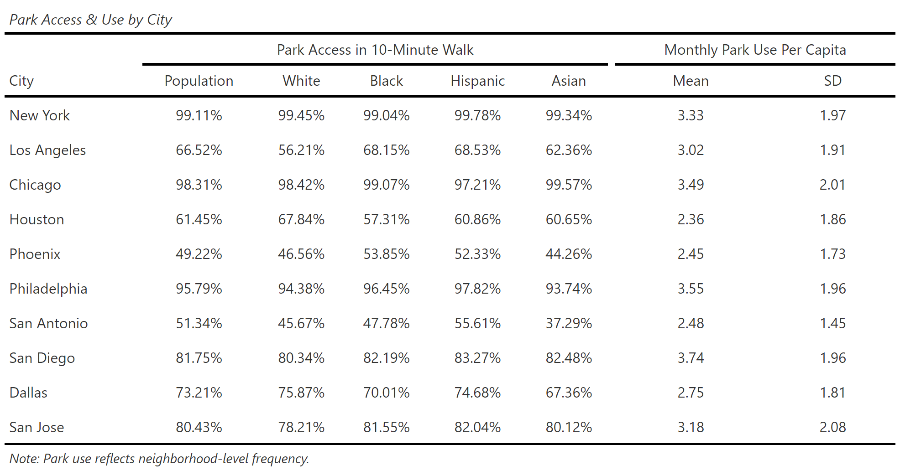
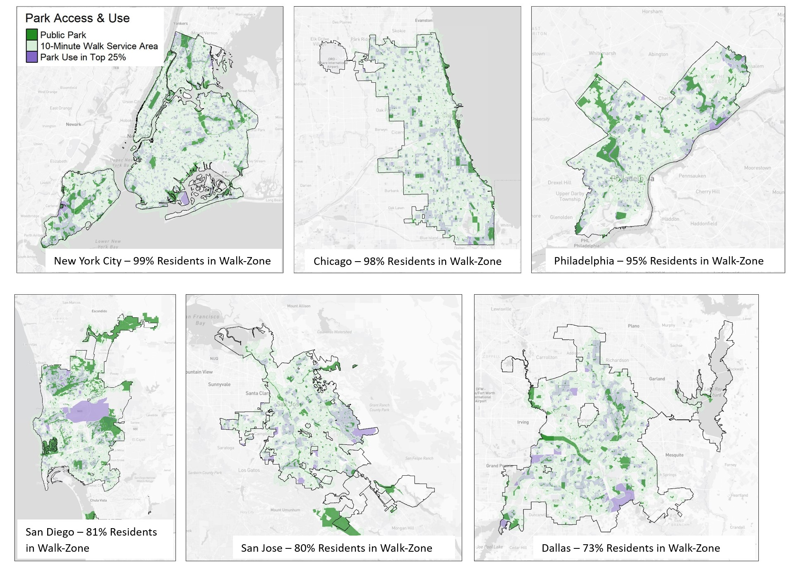
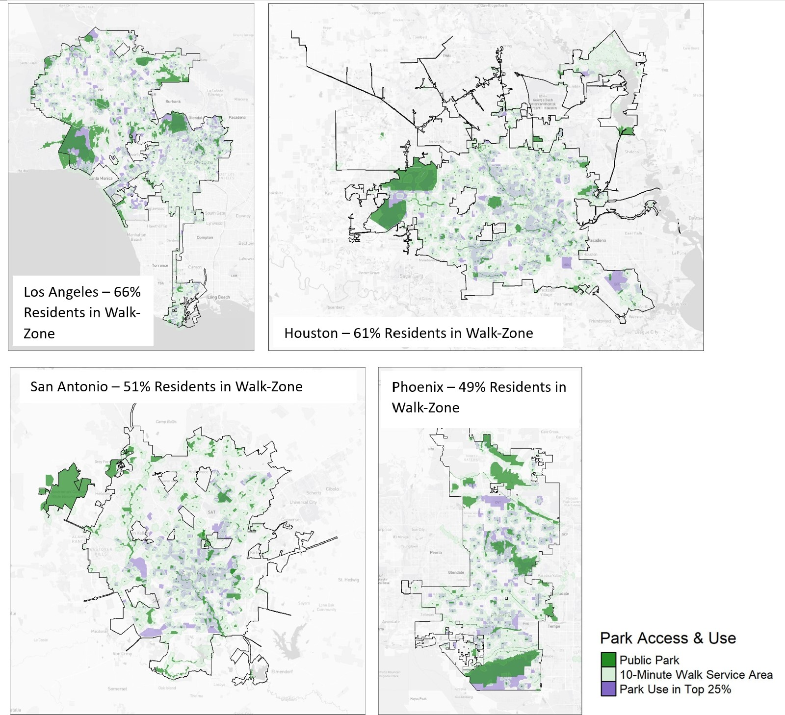

# Data Sources
* Trust for Public Lands Park Database, 2019
* American Community Survey 2015-2019
* SafeGraph's Nature Park Mobility, 2019 

# Analysis: 

I conducted an **accessibility analysis** for parks in the ten most populous cities as of 2019. Following the Trust for Public Land's recommendation to ensure parks are within a 10-minute walk of urban residents, I define the population living within a 10-minute walk of a park as having spatial access. I calculated **10-minute walking zone polygons around each park using Mapbox's isochrone API**. 

After intersecting the isochrone polygons and census block groups, I computed the total population that lives within the isochrones in each city and disaggregated the population by racial/ethnic demographic categories. **I gathered the population estimates for park accessibility by performing simple area-weighted apportionment**, which assumes that the population is evenly distributed across the city block group. 

In addition to mapping the results of the accessibility analysis, I also mapped the census block groups that fell in the top 25% by frequency of monthly trips to the park per capita. **I identified the most frequent park-use subset of census block groups using a spatial SQL query.**

# Results

```{r setup, include=FALSE}
knitr::opts_chunk$set(echo = FALSE)
```

Among America's ten most populous cities, walkable access to parks is highest in the smallest scale, most dense cities. The table below shows that sunbelt cities like Phoenix and San Antonio have the most pronounced access gaps with approximately 50% of the population living within a 10-minute walk of a park. Houston is the only city where walkable park access was statistically significantly lower for non-white populations - Black (57%), Hispanic (61%), Asian (61%) - compared to the white population.

```{r, echo=FALSE, out.height="50%"}

```

The frequency of trips to park per capita across neighborhoods in these ten cities is similar. Monthly per capita trips range from 2.5 in Phoenix to 3.5 in Philadelphia. The maps in Figures 1 and 2 show that highest park use is most prevalent in the neighborhoods with spatial access to parks, especially larger park areas. High park usage rates tend to cluster downtown neighborhoods in the three cities with the lowest level of spatial access - Houston, San Antonio, and Phoenix - which signals the value of walkable amenities in the smaller scale regions of these more car-centric cities. 

```{r, echo=FALSE, fig.cap="Maps of Top 5 Cities by Spatial Access", out.height="50%"}

```

```{r, echo=FALSE, fig.cap="Maps of Bottom 5 Cities by Spatial Access", out.height="50%"}

```