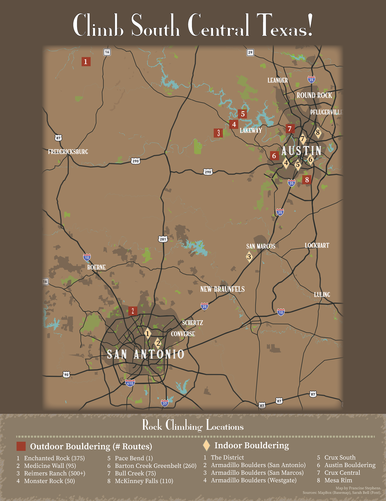

This page is a work-in-progress. It features a few maps that I have created of South Central Texas, which is the region where I grew up in. 

```{r setup, include=FALSE}
knitr::opts_chunk$set(echo = FALSE)
```

## Climb South Central Texas

A map of bouldering locations - outdoor and indoor - in the Texas Hill Country Metro region.

```{r, echo=FALSE}


```

**Sources**

* Map: Mapbox
* Font: Alpine Serif by Sarah Bell


## Fiesta City

A minimalist map of San Antonio colored in the Fiesta celebration theme that I created for a friend. The colors of the land-use layers are applied to only the green space, commercial and industrial, and education/cultural land use attributes.  


```{r, echo=FALSE}
knitr::include_graphics("San Antonio Fiesta City Map.png")

```

**Sources**

* Map: Mapbox
* Landuse Data: Open Street Map 

