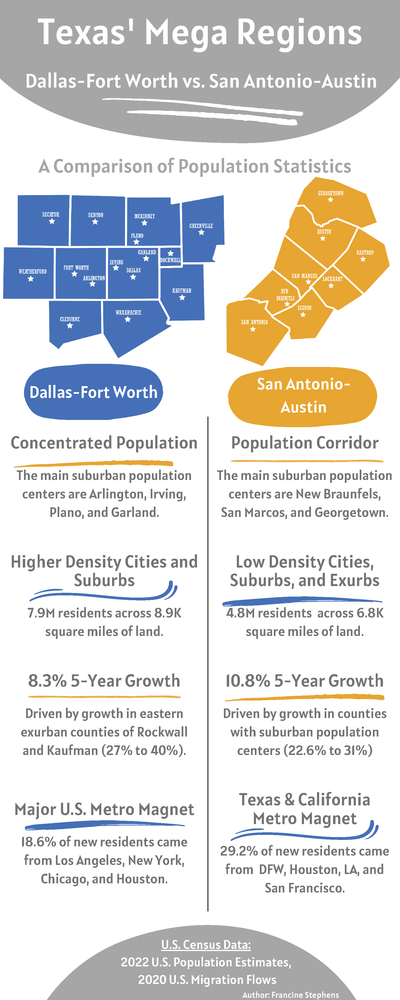

```{r setup, include=FALSE}
knitr::opts_chunk$set(echo = FALSE)
```
 
```{r, echo=FALSE, out.height = "50%"}


```

-----

```{r}
knitr::include_graphics("flows-layout.jpg")

```

**View Github Repo:** <a href="https://github.com/francine-stephens/texas_megaregions" style="margin-left: 1em"> <button class="btn btn-outline-dark"> <i class="fab fa-github fa-lg"></i> Code</button> </a>
